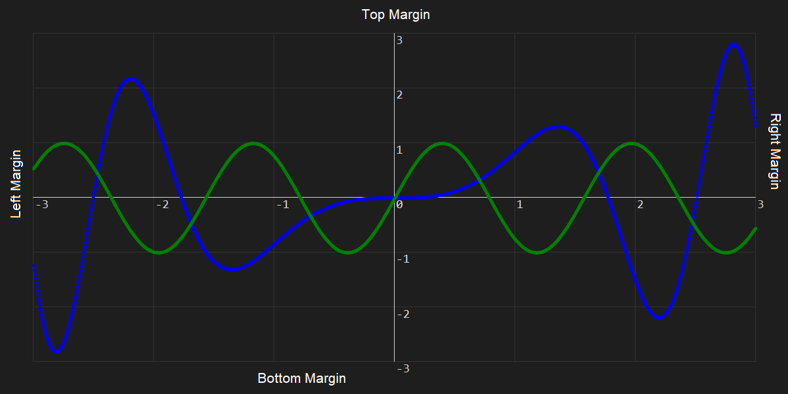

# cartesian-core
.net library that translates any x,y data to pixel coordinates 
- **CartesianCore** the library itself.
- **CartesianCanvasDrawer** an example project that draws graph on a canvas.
- **CartesianBitmapDrawer** an example project that draws graph on a bitmap.
<p align="left">
  
</p>

## public methods
### CartesianCore.Plane
class constructor
```c#
public Plane(int width, int height, int topMargin = 0, int bottomMargin = 0, int leftMargin = 0, int rightMargin = 0)
```
initializes a new plane 
> **width**: width of the area plane to be drawn (pixel)<br>
> **height**: height of the area plane to be drawn (pixel)<br>
> **topMargin**: margin from top to the plane (pixel)<br>
> **bottomMargin**: margin from bottom to the plane (pixel)<br>
> **leftMargin**: margin from left to plane (pixel)<br>
> **rightMargin**: margin from right to plane (pixel)<br>

### CartesianCore.Plane.AddDataset
adds dataset to a plane to be processed and sets plane's maximum & minimum values of each x,y axis.
```c#
public void AddDataset(Dataset dataset)
```
> **dataset**: an instance of a Dataset class

### CartesianCore.Plane.SetAxes
Sets plane's maximum & minimum values of each x,y axis and makes plane ignores calculated maximum & minimum values of each axis from added datasets<br>
This can be called before ``` public void AddDataset(Dataset dataset)```
```c#
public void SetAxes(double xMin, double xMax, double yMin, double yMax)
```
> **xMin**: minimum value of X axis<br>
> **xMax**: maximum value of X axis<br>
> **yMin**: minimum value of Y axis<br>
> **yMax**: maximum value of Y axis<br>

### CartesianCore.Plane.GetDataset
Gets translated coordinates of the given dataset.
```c#
public Point[] GetDataset(int datasetID)
```
> **Point**: A structure that holds X and Y double values<br>
><br>
> **datasetID**: id of the dataset given when created

### CartesianCore.Plane.GetHorizantalLine
Gets a line perpendicular to given y point along the plane width.
```c#
public Point[] GetHorizontalLine(double y)
```
> **Point**: A structure that holds X and Y double pixel coordinates<br>
><br>
> **y**: value of the y point on the Y axis

### CartesianCore.Plane.GetVerticalLine
Gets a line perpendicular to given x point along the plane height.
```c#
public Point[] GetVerticalLine(double x)
```
> **Point**: A structure that holds X and Y double pixel coordinates<br>
><br>
> **x**: value of the x point on the X axis

### CartesianCore.Plane.GetPoint
Gets a point 
```c#
public Point GetPoint(double x, double y)
```
> **Point**: A structure that holds X and Y double pixel coordinates<br>
><br>
> **x**: value of the x point on the X axis<br>
> **y**: value of the y point on the Y axis<br>

### CartesianCore.Dataset
class constructor
```c#
public Dataset(int datasetID)
```
initializes a new dataset<br>
represents a set of data in (x,y) pairs
>**datasetID**: id of the dataset to be used while getting translated coordinates from instance of a plane class.<br>

### CartesianCore.Dataset.Add
Adds data (x,y) pair to the dataset
```c#
public void Add(double xValue, double yValue)
```
> **xValue**: value of the x point on the X axis<br>
> **yValue**: value of the y point on the Y axis<br>

# Example Usage
## CartesianCanvasDrawer
In order to make use of CartesianCore library you need to add compiled CartesianCore.dll file to your project as a reference.
First lets generate some data to draw for the sake of example.
```c#
            var r = new Random();
            int resolution = 1;
            int sample = 1200 / resolution;
            int timeStart = -600 / resolution;
            float coef = 0.005f * resolution;
            timeData = new float[sample];
            sinData = new float[sample];
            someData = new float[sample];

            for (int i = 0; i < sample; i++)
            {
                timeData[i] = (i + timeStart) * coef;
            }

            for (int i = 0; i < sample; i++)
            {
                var t = (i + timeStart) * coef;
                sinData[i] = (float)Math.Cos(4*t);
                someData[i] = t * (float)Math.Sin(Math.Pow(t, 2));
            }
```
Now we have some data to show in cartesian plane.<br>
lets create a plane first
```c#
var plane = new Plane(width, height, 50, 50, 50, 50);
```
we need two dataset instances since we have 2 different data with id of 1 and 2 respectively.
```c#
Dataset dataset_A = new Dataset(1);
Dataset dataset_B = new Dataset(2);
```
put the generated data to datasets<br>
timeData array is representing the X axis for both dataset
```c#
for (int i = 0; i < sample; i++)
{
  dataset_A.Add(timeData[i], someData[i]);
  dataset_B.Add(timeData[i], sinData[i]);
}
```
now we need to put these datasets to the plane instance.
```c#
plane.AddDataset(dataset_A);
plane.AddDataset(dataset_B);
```
maximum and minimum values are calculated for each axis.
its better to floor the minimum values and ceil the maximum values of each axis to get better view on the cartesian plane.<br>
you can comment out the code below to see the differences.
```c#
plane.SetAxes(MathTools.Floor(plane.XAxisMin), MathTools.Ceil(plane.XAxisMax), MathTools.Floor(plane.YAxisMin), MathTools.Ceil(plane.YAxisMax));
```
MathTools static class has an advance Floor and Ceil functions that floors and ceils given value to any number passed as an argument.<br>
or if you know your data you can set the boundries of the plane directly like below.<br> 
```c#
plane.SetAxes(-4, 4, -5, 5);
```
For drawing strings to canvas we need to define a class derived from **FrameworkElement** <br>
we will use this class to draw numbers to cartesian plane<br>
Now lets start to draw plane
Since we set our maximum and minimum values to an integer above we can draw the vertical grids<br>
this is optional you don't need to draw them<br>
```c#
for (int i = (int)plane.XAxisMin; i <= plane.XAxisMax; i++)
{
  points = plane.GetVerticalLine(i);
  DrawLines(CanvasObj, points, color, 1);
  DrawString(CanvasObj, $"{i}", plane.GetPoint(i, 0), 14, Colors.LightGray, new Typeface("consolas"));
}
```
> DrawLines and DrawString functions are defined only for WPF canvas element.<br>
> They have nothing to do with CartesianCore library.<br>

We can do the same for the horizontal grids
```c#
for (int i = (int)plane.YAxisMin; i <= plane.YAxisMax; i++)
{
  points = plane.GetHorizontalLine(i);
  DrawLines(CanvasObj, points, color, 1);
  DrawString(CanvasObj, $"{i}", plane.GetPoint(0, i), 14, Colors.LightGray, new Typeface("consolas"));
}
```
Draw the axes. First X axis
```c#
points = plane.GetHorizontalLine(0);
DrawLines(CanvasObj, points, Colors.LightGray, 1);
```
> I prefer lighter color to highlight to axes since I choose the dark backround.<br>
> I used the same color as the girds since drawing twice makes them little bit more highlighted.<br>

Then Y axis
```c#
points = plane.GetVerticalLine(0);
DrawLines(CanvasObj, points, Colors.LightGray, 1);
```

Now we can draw our data. Remember we need to use the ids given previously to get them.<br>
Ids are useful for customizing any dataset.<br>
```c#
points = plane.GetDataset(1);
DrawPoints(CanvasObj, points, Colors.Blue, 3);

points = plane.GetDataset(2);
DrawPoints(CanvasObj, points, Colors.Green, 3);
```
